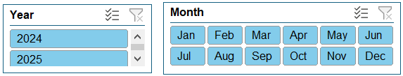
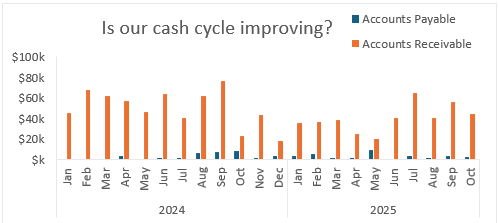
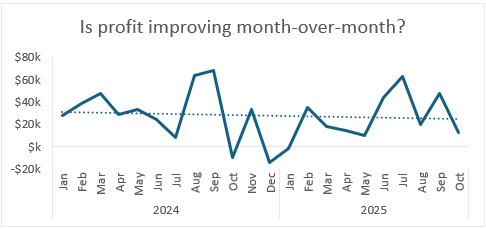
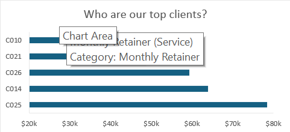
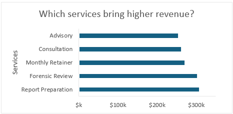
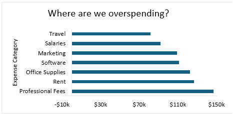
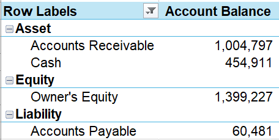

# Excel Financial Dashboard

## Introduction
This project includes a fully linked Income Statement, Balance Sheet, and an interactive Financial Dashboard for tracking revenue, expenses, profit, AR/AP, and spending categories.
### Overview
### Dashboard File
My final dashboard is in [Excel_financial_dashboard.xlsx](Financial_Dashboard/Excel_financial_dashboard.xlsx).
### Excel Skills Used
### Dataset
## Dashboard Build
### Slicers

### KPIs

### Revenue vs Expense Trend

### Cash Cycle (AR vs AP)

### Profit Trend

### Top Clients

### Revenue by Services

### Spending Categories

### Income Statement

### Balance Sheet

## Key Learnings & Techniques
## Conclusion